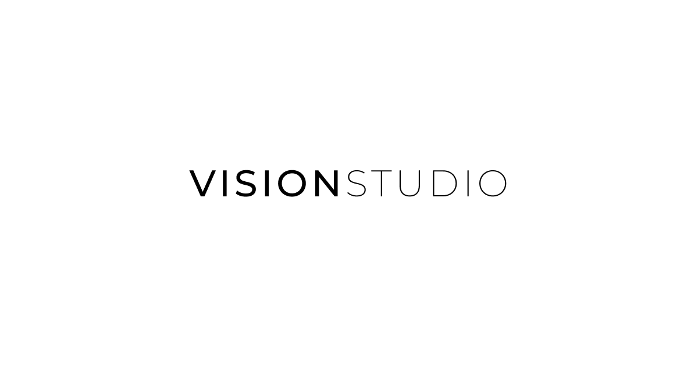

# Vision Studio 📷


[](https://vision-studio-chi.vercel.app)

This is a photography portfolio website built using Astro and integrated with Storyblok CMS.

## 🔥 Features

- [x] Storyblok CMS integration
- [x] SEO-friendly
- [x] Responsive design
- [x] Locomotive Scroll
- [x] GSAP animations
- [x] Google Analytics integration
- [x] Leaflet Map integration
- [x] Newsletter integration with SendGrid
- [x] Static Site Generation (SSG)

## 💻 Built with


## 🚀 Demo

[](https://vision-studio-chi.vercel.app)

## 🔍 Prerequisites

- NodeJS
- Yarn

## 🛠️ Installation Steps

1. Clone the repository

   ```bash
   git clone https://github.com/xkarol/vision-studio.git
   ```

2. Change directory

   ```bash
   cd vision-studio
   ```

3. Install dependencies

   ```bash
   yarn install
   ```

4. Create `.env` file based on `.env.example`

   > You can get api keys here:
   >
   > [STORYBLOK_TOKEN](https://www.storyblok.com/faq/where-to-find-my-content-delivery-api-key)
   >
   > [SENDGRID_API_KEY, SENDGRID_MAILING_ID](https://docs.sendgrid.com/ui/account-and-settings/api-keys)
   >
   > [STADIA_API_KEY](https://docs.stadiamaps.com/authentication/)

5. Run the app

   ```bash
   yarn dev
   ```
